# Rapport final

## Rappel du sujet

### Contexte

L'avènement des boutiques de prêt à porter en ligne à apporter de nouveaux besoins aux consommateurs. La solution FitSize a été imaginée pour répondre à ces besoins en facilitant au maximum le choix de la taille de nos vêtements de rêve et en limitant le nombre de retours.

### Présentation de la solution

La solution FitSize comme nous l’avons imaginé est composé de 3 applications :
- Une application mobile permettant à l’utilisateur d’enregistrer ses modèles. L’utilisateur sera amené à prendre une photo de son vêtement accompagné d’un objet témoin (carte de crédit, pièce de monnaie…) sur une surface plane. Il indiquera ensuite la dimension de l’objet témoin ainsi que ses limites en plaçant 2 points sur l’image. Enfin, il placera des points de repères déterminant les dimensions de l’habit en se basant sur une photo guide.
- Un serveur où seront effectués les calculs et qui enregistrera les données dans la base de données.
- Un plugin web qui permet à un utilisateur de trouver la taille idéale pour le modèle qu’il consulte sur un site marchand.

Au cours de ce projet, nous avons travaillé sur l'application mobile ainsi que le backend, mais pas sur le plugin web.

## Architecture technique

### Fonctionnement général

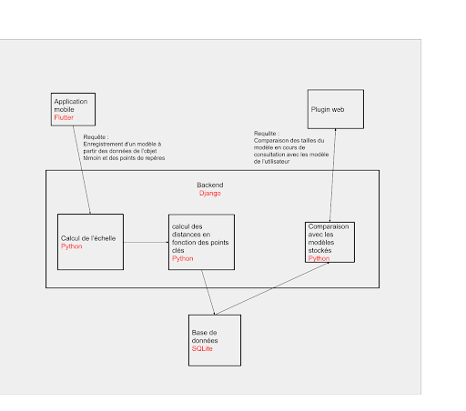

Afin d’enregistrer un nouveau modèle, l'utilisateur doit se munir de son vêtement (parfaitement à sa taille) ainsi que d’un objet témoin. L’objet témoin peut être une carte de visite, une pièce de monnaie ou même une règle graduée du moment que l’utilisateur connaît sa taille exacte. L’utilisateur prend d’abord une photo de son vêtement sur une surface plane, avec l’objet témoin posé à côté ou au-dessus. Il indique ensuite les limites de l’objet témoin à l’aide de deux points ainsi que la distance séparant ces deux points.
Puis il placera des points de repères sur le vêtement aux endroits indiqués sur le guide. Une fois tous les points entrés, les dimensions sont prêtes à être calculées. Les informations indiquées par l’utilisateur sont alors envoyées au serveur backend, qui va se charger de calculer les dimensions clés du vêtement, comme le tour de hanches, la hauteur… Le modèle est ensuite enregistré en base de données, il est prêt à être comparé aux modèles des sites marchands.

### Frontend

Le frontend est la partie avec laquelle l’utilisateur va interagir et se présente ici sous la forme d’une application mobile. 
Nous avons utilisé Le framework Flutter, avec le langage Dart pour le développement de cette application. Cette technologie n’a pas été un choix de notre part, mais de la part du client. L’avantage majeur de cette technologie est qu’elle permet le développement multiplateforme. En effet, le client souhaitait que l’application soit disponible sous android et sous IOS.
L’utilisation souhaitée de cette application est de permettre à l’utilisateur de prendre en photo un habit avec un objet témoin placé à côté de ce dernier. Il faut ensuite placer des points de repères aux endroits stratégiques sur la photo, comme indiqué dans l’exemple. L’application va alors envoyer les coordonnées des points à la partie backend pour que celle-ci calcul les dimensions de l’habit. Une fois enregistré l’utilisateur pourra alors retrouver ses modèles sur la page principale de l’application. Les modèles sont enregistrés sur la base de données du serveur afin que l’utilisateur puisse changer de téléphone ou encore supprimer et réinstaller l’application sans perdre ses données. L’accès à ces données se fait donc par le biais d’une authentification sur l’application.

### Backend

Le système FitSize nécessitait un serveur afin de pouvoir gérer les informations envoyées par l'application mobile. 
En effet, l'acheteur qui effectue ses achats sur le site de vente en ligne a besoin de transmettre les dimensions d'un vêtement de sa garde robe qui lui va, et l'administrateur qui gère la boutique de vêtements a besoin de transmettre les dimensions et les tailles des vêtements qu'il vend. 
L'ensemble de ces informations rend possible la comparaison entre la taille du vêtement de l'acheteur avec la taille de l'article sur le site de vente en ligne.

Dès le début du projet, l'équipe FitSize nous a informé de leur désir d'incorporer de l'intelligence artificielle et la reconnaissance par ordinateur (Computer Vision) afin de pouvoir automatiser la reconnaissance des dimensions du vêtement lorsque l'utilisateur le prend en photo avant l'envoi d'informations au serveur.
Pour le choix du langage utilisé pour le backend, nous avions comme contrainte l'utilisation de Python de part la volonté de l'équipe de pouvoir utiliser la bibliothèque CV2 pour Python, qui fournit des fonctions de traitement d'images en temps réel.

De par les contraintes en temps, nous avons eu besoin d'un framework en Python permettant de construire rapidement des interfaces web et un serveur. Nous avons donc opté pour le framework Django, basé sur le développement rapide et le design simple.

La base de données par défaut est SQLite, qui a pour principal avantage sa facilité d'utilisation et ses fonctionnalités de création de base de données automatique. Cette technologie nous a donc semblé être idéale afin de concevoir une première version de l'application en local.

Au cours du développement de l'application, nous avons utilisé divers modules nous permettant d'atteindre nos objectifs :
- Django REST framework, un toolkit permettant de mettre en place une gestion de la base de données depuis l'application
- Factory Boy, un module permettant de créer des tests aléatoires et des instances de modèles facilement

Nous détaillerons l'utilisation de ces technologies dans la suite de ce rapport.

## Réalisations techniques

### Frontend

Nous allons vous présenter les différentes interfaces ainsi que leur fonctionnement. L’application est globalement constitué de 4 interfaces différentes qui ne sont malheureusement pas toutes terminées par manque de temps. 

#### 1. Interface de connexion

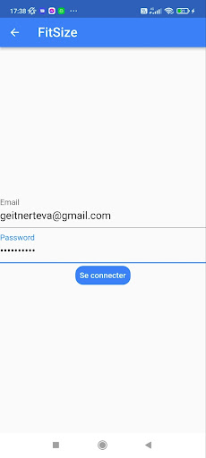

Voici l’interface de connexion d’un utilisateur. Elle ne représente pas le cœur de notre projet, c’est pourquoi nous ne l’avons pas fait de manière exhaustive. En effet, celle-ci ne réalise pas une authentification complète. Elle ne communique pas avec le Backend et redirige simplement sur l’espace l’écran d'accueil qui n’est donc pas personnalisé.

#### 2. Écran d’accueil

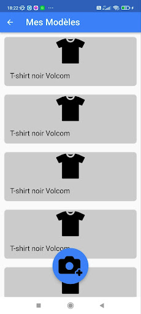

Voici l’interface qui permet à l'utilisateur de visualiser les modèles qu’il à déja enregistrés. Cette page affiche de manière itérative les modèles contenus dans un tableau. La version que nous aurions voulu réaliser aurait fait un appel au backend pour récupérer les modèles de l’utilisateur connecté, et ensuite pouvoir afficher les modèles de l’utilisateur courant.
Lorsque celui-ci veut enregistrer un nouveau modèle, il peut alors le faire en appuyant sur le bouton flottant avec l’appareil photo.

#### 3. Prise de photo

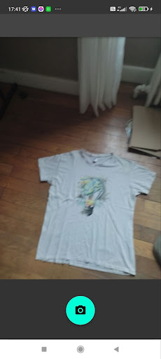

Pour enregistrer un nouveau modèle, l’utilisateur doit avant tout prendre son habit en photo. Cette interface est un appareil photo intégré à l’application qui affiche à l’écran directement ce que voit la caméra. Pour ceci, flutter permet d’initialiser les caméra du téléphone grâce à ses librairies.
Avant d’afficher l’appareil photo nous aurions voulu mettre une page d’informations qui permettrait d’expliquer à l’utilisateur de bien poser l’habit à plat, de prendre la photo d’au dessus, et de poser l’objet témoins à coté.

#### 4. Placement des points de repère

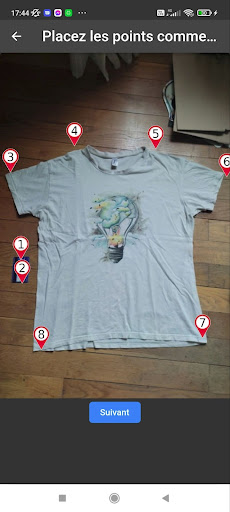

Après avoir pris la photo, l’utilisateur arrive sur l’interface où il devra placer les différents points de repères en suivant les instructions. 
En effet, nous aurions voulu insérer un onglet coulissant qui expliquerait comment placer les points. Il faudrait les placer dans un ordre précis selon le type d’habit, et surtout à des endroits bien précis en suivant l’exemple que nous proposerions. 
L’utilisateur peut donc placer ses points les uns après les autres, et une fois ceci terminé il peut alors valider en appuyant sur suivant.
Pour chaque point placé, les coordonnées de ces derniers sont enregistrées dans un tableau.

#### 5. Validation et objet de référence

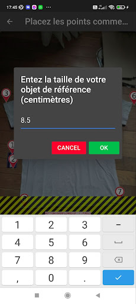

Lorsque l’utilisateur appuie sur le bouton “suivant” de l’interface précédente, une fenêtre de dialogue apparaît alors pour demander à l’utilisateur la taille de l’objet de référence qu’il à indiquer sur l’image. La taille de l’objet est la distance entre les deux extrémités indiqués par les deux points de repères placés sur ce dernier. Cette distance sera donc la distance de référence et qui permettra alors au backend de mesurer toutes les autres dimensions nécessaires.
Lorsque l’utilisateur valide la taille qu’il a saisie, l’application envoie une requête au backend contenant les coordonnées de tous les points par rapport à l’image ainsi que la taille de l’objet de référence. Lorsque la réponse que l’application reçoit atteste que la requête a fonctionné comme il le faut, alors nous sommes redirigés sur l’écran d'accueil. 
Nous aurions souhaité pouvoir effectuer un vrai enregistrement de modèle afin que l’on puisse ensuite voir le nouveau modèle s’afficher sur l’écran d'accueil.

### Backend

#### Fonctionnement du serveur

L'architecture de notre application serveur est la suivante :

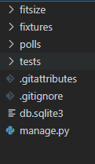

- fitsize : Configuration générale du projet : fichiers de configuration, de paramétrage et de définition des liens (endpoints, la liste est disponible dans les documents techniques)
- fixtures : Contient les fichiers utilisés afin de générer une base de données par défaut (la procédure est détaillée dans le guide d'utilisation du système FitSize). 
- polls :  Définition des éléments nécessaires à la conception des éléments stockés dans la base de données : models, serializers, views
- tests : Fichiers de tests unitaire, de non-régression et définition des modèles utilisés par les tests

En ce qui concerne la conception de la base de données et des modèles qui la constituent, nous avons établi la structure qui est répertoriée en annexe.
La liste des modèles est la suivante :
- User : contient les données relatives à un compte (login et mot de passe)
- Company : contient les données relatives à la compagnie qui produit des vêtements (nom, addresse)
- Size : représente une taille de vêtements (contient un nom/label, et une origine)
- ClothingType : Type de vêtement, contient un nom ainsi qu' un tableau de points qui sont utilisés dans l'interface afin de montrer à l'utilisateur de l'application mobile quels sont les points à indiquer sur le vêtement
- UserModel : représente le vêtement de l'acheteur d'un vêtement, celui de sa garde robe qu'il utilise afin d'informer des dimensions qu'il souhaite avoir pour le vêtement qu'il veut acheter. Contient un nom, des dimensions et est en lien avec un compte utilisateur (User) et un type de vêtement (ClothingType)
- CompanyModel : représente le modèle qui est vendu par la compagnie. Contient dans ses champs une couleur, des dimensions et est en lien avec un type de vêtement (ClothingType), une Companie (Company) et une taille (Size).

Nous allons détailler le contenu de l'application en prenant comme exemple l'instance UserModel stockée dans la base de données.
En suivant l'architecture que nous avons établie en début de projet, nous avons défini les Models qui sont utilisés par Django afin de structurer et de permettre la manipulation des données de notre application. C'est ce qui définit les types et champs des instances stockées dans la base de données. Nous utilisons par ailleurs des relations entre nos Models (One to Many).

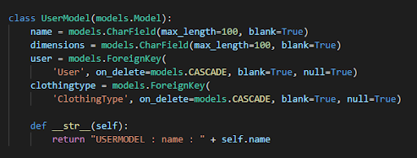

Les Serializers de Django REST Framework, définis en fonction des Models, permettent de convertir les instances de la base de données en types Python natifs, qui sont par la suite traités sous le format JSON lors des requêtes et des accès via les endpoints.

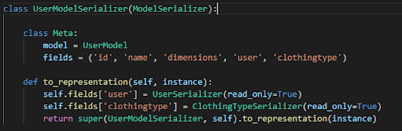

Les Views permettent d'établir la logique lors des accès aux endpoints (URI) par l'utilisateur de l'application (méthodes POST, GET, DELETE …)  et pour le retour des réponses du serveur.
Nous avons utilisé des ViewSet disponibles dans le module Django REST Framework, qui permettent de fournir un set de méthodes "par défaut", telles que l'obtention d'une ressource, de toutes les ressources d'une certaine catégorie, ou la suppression d'une ressource. Nous pouvons par ailleurs rajouter nos propres endpoints, avec un nom personnalisé et un appel à une fonction définissant le comportement lors de l'utilisation du endpoint.

Dans notre projet, nous avons ajouté un endpoint personnalisé afin de pouvoir convertir le champ dimension  du model UserModel tel qu'envoyé par l'application mobile au backend (voir la méthode saveFromKeyPoints, définissant le comportement de la méthode POST pour le endpoint polls/usermodel/savedimensions ).

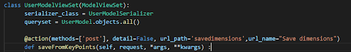

Les données envoyées par l'application mobile (coordonnées de points pour l'objet témoin, distance entre ces deux points et les coordonnées des points pour le vêtement) sont envoyées suivant une syntaxe fixée et stockées dans une string.
L'application utilise donc le endpoint polls/usermodel/savedimensions et le serveur réalise l'action de décodage du message pour obtenir les données et le produit en croix afin de sauvegarder le UserModel avec les dimensions réelles du vêtement déterminées grâce aux informations de l'objet témoin. 

Les endpoints génériques sont possibles grâce à l'utilisation d'un routeur fourni par le Django REST Framework, le SimpleRouter() . Il fournit des endpoints de création, d'accès, de mise à jour et de suppression de ressources. Les endpoints génériques sont créés à partir du nom et de la View qui sont indiqués en paramètre lors de l'enregistrement de la route par le routeur. La liste des endpoints disponibles est disponible dans les documents techniques.

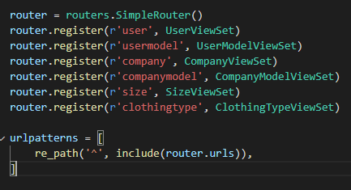

#### Tests

Nous avons réalisé majoritairement des tests de non régression afin de vérifier le bon fonctionnement et la logique de l'accès aux données de la base de données via les endpoints.
Pour cela, nous avons utilisé l'outil Factory Boy. Il permet la mise en place de Factories qui automatisent la création de Models pour les tests. Les Models créés au cours des tests grâce à ces Factories sont sauvegardés dans une base de données qui est vidée à l'issue des tests.
Le module est fourni avec l'outil Faker, qui permet de générer diverses fake data, afin d'obtenir des instances différentes à chaque lancement des tests.

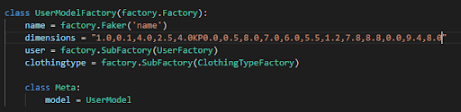

Dans cet exemple de test, on observe que l'appel à la Factory de UserModel nécessite également l'appel à des Sub Factories de part les relations de UserModel avec les Models User et ClothingType. Au cours de nos tests, nous devons donc nous assurer de sauvegarder dans la base de données les champs correspondants avant de procéder à la sauvegarde de UserModel, car UserModel doit posséder dans ses champs un User et un ClothingType déjà sauvegardés dans la base de données afin d'être créé.

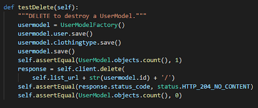

Au moment d'écriture de ces lignes, nous possédons 31 tests, couvrant l'instanciation des Models,  l'instanciation des Serializers, et l'utilisation des endpoints disponibles (création, suppression, accès à une/des données)

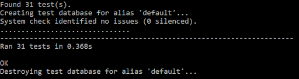

#### Améliorations possibles

Les réalisations effectuées pour le serveur sont finalement assez minimalistes, nous avons cependant établi les bases du projet et profité des avantages du framework Django afin de fournir le comportement attendu d'une API Web.
Certaines améliorations possibles sont :
- Une comparaison des UserModels avec les CompanyModels
- Une sécurité pour la connexion de l'utilisateur à l'application
- Une utilisation d'une autre base de données. SQLite est adéquat pour une utilisation en local, et il nous a permis de gagner du temps afin de nous focaliser sur ce que nous ne connaissions pas du framework Django, cependant une base de donnée telle que PostgreSQL sera indispensable lors de la mise en production du serveur et de l'application.

Ces modifications peuvent être facilement mises en place de par les fonctionnalités de Django qui permettent une mise à jour rapide du projet.

## Gestion de projet

### Suivi de projet

Tout au long de ce projet, nous avons rempli un document répertoriant nos avancées du jour, nos blocages, nos interrogations…

### Conception

Nous avons débuté ce projet par une phase de conception, au cours de laquelle nous avons exploré de nombreuses solutions techniques potentiellement intéressantes pour notre application. Nous avons effectué plusieurs brainstorming lors de cette phase afin d’amplifier notre créativité et découvrir des solutions innovantes.

### Backlog

Une fois la phase de conception terminée, nous avons mis en place un backlog afin de répertorier les différentes tâches nécessaires à la réalisation de ce projet. Pour chaque tâche, nous avons associé une quantité d’effort estimée ainsi qu’une priorité.

### Division des tâches

Un fois le backlog écrit, nous avons pu nous répartir les tâches. Téva Geitner a travaillé sur l’application mobile tandis que Yaël Para et Jules Gonzalez ont travaillé sur la partie backend. Au sein du backend, le travail a également été réparti pour la découverte de Django Rest Framework ainsi que pour la mise en place de l’application.

### Github

Nous avons utilisé l’outil github afin de partager le code et les documents produits. 3 dépôts ont été ouverts, le premier pour la documentation, le second pour l’application mobile (frontend) et le troisième pour le serveur (backend). Nous avons utilisé de nouvelles branches pour chaque fonctionnalité, et avons effectué des revus de code à chaque merge vers la branche principale.

### Pair programming

Pour certaines tâches, comme le calcul des dimensions et l’enregistrement du modèle utilisateur, nous avons travaillé en pair programming. Pour ce faire, nous avons mis en place des sessions de programmation partagée via l’extension Live Share présente dans visual studio code. Ces sessions nous ont permis de travailler sur le même code depuis deux machines différentes, et d’expliquer certains points de manière beaucoup plus efficace grâce à la fonction de suivi qui permet de voir les actions des autres participants en temps réel.

### Communication interne

Nous avons utilisé l’outil Discord pour la communication interne à notre équipe. Un canal vocal nous a servi quand nous travaillions à distance, et des canaux écrits étaient présents pour notifier les autres de nos avancés et blocages dans les différentes parties du projet.

### Communication client

Notre communication avec le client s’est principalement effectuée à travers des réunions bihebdomadaires à travers le service Google Meet. Ces réunions duraient entre 30 et 60 minutes. Elles avaient pour objectif de tenir le client au courant de nos avancées, de discuter des choix techniques que nous devions prendre et d’obtenir un feedback sur notre travail.

## Outils

Nous avons utilisé Android Studio comme environnement de développement pour la partie frontend. C’est l'environnement de développement le plus adapté et simple d’utilisation pour le besoin que nous avions.
Pour la partie backend, nous avons développé avec Visual Studio Code et avons utilisé Postman pour tester le bon fonctionnement des requêtes. Nous avons choisi ces outils car nous les avions déjà utilisés auparavant et avions donc de bonnes bases.

## Métriques logiciels

Ci dessous le récapitulatif fourni par GitHub concernant le nombre de commits effectués et le nombre de lignes de code écrites durant le projet.

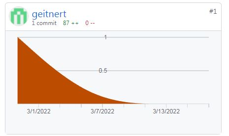
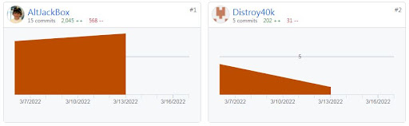

## Conclusion

A l'issue de ce projet, nous n'avons pas réalisé tous les objectifs que nous nous étions fixés, cependant nous avons énormément appris grâce à sa pluridisciplinarité. Nous avons eu à réaliser la conception, la veille technologique, une API Web et une application mobile sur des technologies nouvelles.
Nous avons été libres durant ce mois de Projet de Fin d'Études,  ce qui nous a permis d'expérimenter, de prendre des risques, et de se faire une meilleure idée de ce en quoi consiste notre métier.
Nous avons pu travailler sur une application qui répond à un besoin majeur pour les utilisateurs de sites de vente de vêtement en ligne, et qui est porté par une équipe avec qui il a été agréable de travailler.
Nous avons établi les bases et le squelette de ce que deviendra l'application FitSize, et nous sommes curieux de voir son évolution.

## Bibliographie

- [FitSize]
- [Django]
- [Django rest framework]
- [Python]
- [SQLite]
- [Flutter]
- [Dart]

[FitSize]: http://fitsize.fr/
[Django]: https://www.djangoproject.com/
[Django rest framework]: https://www.django-rest-framework.org/
[Python]: https://www.python.org/
[SQLite]: https://www.sqlite.org/index.html
[Flutter]: https://flutter.dev/
[Dart]: https://dart.dev/
